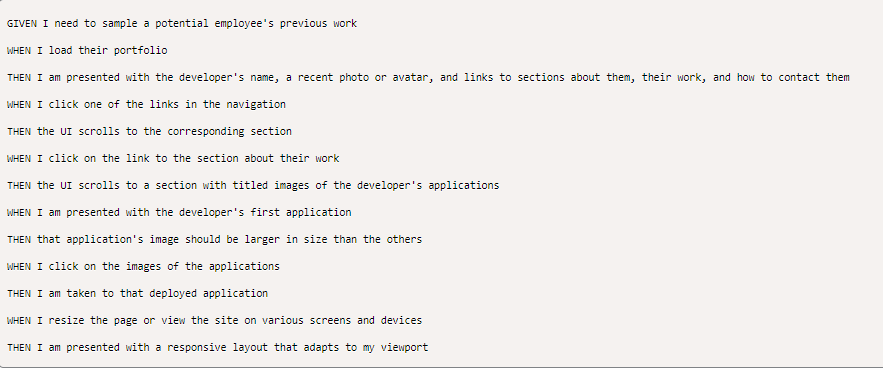
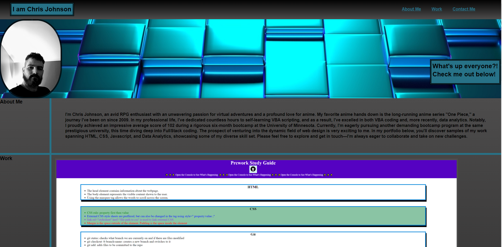

Repository for Module 2 Challenge Assignment

# Advanced CSS Challenge: Professional Portfolio

A portfolio of work can showcase your skills and talents to employers looking to fill a part-time or full-time position. An effective portfolio highlights your strongest work as well as the thought processes behind it. Students who have portfolios with deployed web applications (meaning they are live on the web) are typically very successful in their career search after the boot camp. This last point can't be stressed enough: having several deployed projects is a minimum requirement to receive an initial interview at many companies.

With these points in mind, in this Challenge I will set myself up for future success by applying the core skills I've recently learned: flexbox, media queries, and CSS variables. I will get to practice my new skills while creating something that I'll use during my job search. It's a win-win that I will likely be grateful for in the future!

# User Story

AS AN employer
I WANT to view a potential employee's deployed portfolio of work samples
SO THAT I can review samples of their work and assess whether they're a good candidate for an open position

# Acceptance Criteria

Here are the critical requirements necessary to develop a portfolio that satisfies a typical hiring manager's needs:

# Screenshot of Deployed Application

# Link to Deployed Application
https://c-johnson83.github.io/portfolio/
